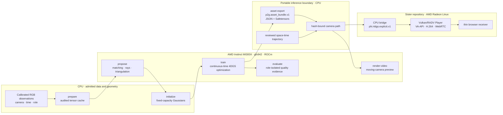

# Pixel4DGS

[](https://github.com/phi-media-lab/4dgs-reconstruction-phi/actions/workflows/cpu-ci.yml)
[](https://github.com/phi-media-lab/4dgs-reconstruction-phi/actions/workflows/release-check.yml)

Pixel4DGS is an architecture-first, trainable pixel-to-4D-Gaussian
reconstruction system developed by Phi Media Lab in collaboration with AMD.
It turns synchronized, calibrated multi-camera RGB video into an explicit,
continuous-time Gaussian scene that can be inspected, evaluated, exported,
and rendered from a moving camera.

This repository is the asset-production half of a two-repository AMD system.
AMD Instinct MI300X with ROCm owns correspondence, optimization, evaluation,
and offline rendering. The sister
[4DGS Viewer Phi](https://github.com/phi-media-lab/4dgs-viewer-Phi) project
converts the resulting inference asset and serves it from an AMD Radeon Linux
node through Vulkan, hardware H.264, and WebRTC. The repositories share a
versioned, hash-closed artifact—not a source tree, Python environment, or
training workspace.

## System architecture



The command-line stages and the top-level runner call the same library
functions. `p2g run` sequences verified outputs and resume receipts; it does
not hide a second reconstruction path. Training ends at a portable inference
asset. Interactive delivery begins only after that asset crosses into the
Viewer repository.

## AMD hardware and software co-design

The design gives compute and delivery different AMD hardware roles instead of
forcing both workloads into a lowest-common-denominator runtime.

| System concern | Reference design | Consequence |
| --- | --- | --- |
| Reconstruction compute | One AMD Instinct MI300X, `gfx942` | The GPU ABI is admitted explicitly; v0 does not claim generic CUDA, multi-GPU, or arbitrary ROCm support |
| Training runtime | Linux x86-64, CPython 3.12, PyTorch `2.10.0+rocm7.0`, HIP `7.0.51831` | Source, wheel identity, HIP runtime, and `gfx942` code objects are checked before native execution |
| Differentiable rasterization | Pinned AMD Ecosystem gsplat source, float32, packed mode, `tile_size=8`, one camera, classic EWA, RGB or SH3 | The adapter fixes every renderer switch and rejects unqualified shapes, dtypes, devices, and ABIs |
| Hot training path | Struct-of-arrays tensors, vectorized time materialization, memory-mapped observations, one packed raster call | No Python loop over Gaussians and no image or Gaussian transfer to the host in the materialization/raster path |
| Population and memory | Fixed-capacity relocation with stable slot lineage | Quality can be redistributed without unbounded Gaussian growth or opaque allocator behavior |
| Resource admission | AMD SMI/ROCm SMI observations plus `/dev/kfd` process identity and full-stage resource-window recording | Shared quality runs and exclusive performance runs have different, replayable admission semantics |
| Interactive delivery | AMD Radeon, Linux `amdgpu`/DRM, Mesa RADV, Vulkan, DMA-BUF, VA-API, GStreamer, WebRTC | The Viewer renders and encodes without depending on ROCm, PyTorch, the dataset, or the optimizer |

The specialization is deliberate. Correctness is established at explicit
boundaries—camera geometry, tensor layouts, native ABI, gradients, artifact
hashes, and observation roles—before a result is treated as MI300X evidence.
Portable CPU tests validate contracts and failure behavior; they are not
presented as proof of native-kernel quality or scene-level performance.

See [MI300X runtime build](docs/MI300X_RUNTIME_BUILD.md),
[renderer contract](docs/RENDERER_CONTRACT.md), and
[MI300X preflight](docs/MI300X_PREFLIGHT_CONTRACT.md) for the exact qualified
software stack and execution gates.

## Reconstruction pipeline

| Stage | Mechanism | Output | Execution surface |
| --- | --- | --- | --- |
| `prepare` | Validate camera, time, photometry, hashes, paths, and role isolation; materialize an append-only RGB tensor cache | `p2g.tensor_cache.v1` | CPU |
| `propose` | Match train-only views, restore admitted pixel coordinates, construct rays, triangulate, and retain rejection evidence | Proposal collection | MI300X |
| `initialize` | Select multi-view evidence and derive position, motion, scale, duration, appearance, and stable slot identity | `p2g.gaussian_initialization.v1` | CPU |
| `train` | Materialize Gaussians at sampled time, rasterize, optimize declared losses, and relocate under a fixed budget | Hash-closed run and checkpoints | MI300X |
| `evaluate` | Render diagnostic or explicitly admitted sealed observations without feeding them back into optimization | Evaluation receipt | MI300X |
| `asset export` | Remove optimizer state and publish only portable inference tensors plus provenance | `p2g.asset_bundle.v1` | CPU |
| `render-video` | Evaluate a bundle along a separately bound space-time camera trajectory | Video and render receipt | MI300X |

The input authority is an observation manifest, not a dataset-specific loader.
The Charge adapter imports calibrated still-image tasks without copying source
pixels. The SelfCap adapter materializes synchronized video into RGB8 PNGs and
a **per-frame, per-camera observation manifest**, while recording
synchronization, undistortion, crop, resize, quantization, and source hashes.
Both adapters keep train, diagnostic, and sealed observations disjoint.

## White-box 4DGS model

Each Gaussian stores a reference mean, velocity, log scale, quaternion,
opacity logit, spherical-harmonic appearance, center time, bounded duration,
optional learned persistence, and stable runtime identity. At query time
$t$:

$$
\boldsymbol{\mu}_i(t) = \boldsymbol{\mu}_i
  + \boldsymbol{v}_i(t-c_i)
$$

$$
g_i(t)=\exp\left[-\frac{1}{2}
  \left(\frac{t-c_i}{\sigma_i}\right)^2\right], \qquad
a_i(t)=p_i+(1-p_i)g_i(t)
$$

$$
\alpha_i(t)=\operatorname{sigmoid}(o_i)\,a_i(t)
$$

Time therefore changes position and activation through named state; it is not
hidden inside color, scale, or a frame-indexed neural decoder. Duration is
bounded, quaternions are normalized, and log scales are exponentiated at
materialization. A developer can inspect the exact Gaussian state presented to
the rasterizer at any continuous time.

One optimization step has a fixed order: sample a train observation,
materialize, rasterize, compute named losses, backpropagate, reject invalid
gradients, update parameters, and then execute scheduled population-control
and screen-influence events. L1, Gaussian-window SSIM, LPIPS, PSNR, and each
regularizer remain separately attributable in metrics and receipts.

## Correctness invariants

- **Role isolation.** Only `train` observations may affect proposals,
  initialization, optimization, screen guards, early stopping, or checkpoint
  selection. `diagnostic`, `sealed`, and `free_view` capabilities are distinct.
- **Fail-closed native execution.** An unregistered Torch/ROCm/provider ABI,
  GPU architecture, tensor layout, or raster option is rejected before kernel
  launch.
- **Fixed population.** Relocation reuses dead slots, preserves stable lineage,
  and invalidates the corresponding optimizer rows explicitly.
- **Hash-closed state.** Stage inputs and outputs bind their dependencies by
  SHA-256; terminal manifests are published last, so partial output cannot be
  silently resumed.
- **Narrow trust boundary.** Checkpoints are local trusted resume state.
  Exchange assets contain JSON and Safetensors only—never executable pickle,
  source images, optimizer state, or an implicit training environment.
- **Independent evidence.** Source CI, native numerical qualification,
  full-scene reconstruction quality, Viewer conversion, and browser delivery
  are separate claims with separate receipts.

## Asset boundary and Viewer

Pixel4DGS exports `p2g.asset_bundle.v1`; a camera trajectory is an independent
artifact and becomes renderable only after it is hash-bound to that bundle.
For the supported interop profile, the Viewer CPU bridge verifies the bundle,
requires learned persistence, SH degree 3, classic rasterization with
`radius_clip = 0`, and converts it deterministically to
`phi.4dgs.explicit.v1`.

The hand-off has been exercised with a 499,980-Gaussian SH3 real-scene asset:
offline conversion, AMD Vulkan rendering, VA-API H.264 encoding, WebRTC
presentation, and browser camera/time interaction completed. The authorized
preview is published by the
[Viewer repository](https://github.com/phi-media-lab/4dgs-viewer-Phi).
This establishes the artifact and serving path for that asset; it is not a
claim of universal bundle compatibility, reproduction of that training run by
the current public source, cross-renderer pixel parity, or long-duration
service stability.

See [Viewer interoperability](docs/VIEWER_INTEROP.md) and the checked-in
[Viewer profile](examples/viewer-interop/profile.toml).

## Current validated envelope

| Established by this repository | Deliberately separate or not yet claimed |
| --- | --- |
| Complete CPU contract suite, lint, typing, clean committed source-boundary checks, and reproducible wheel/sdist checks | CPU CI as evidence of MI300X throughput or visual quality |
| Full prepare → propose → initialize → train → evaluate → export implementation with stage receipts and exact resume semantics | Support for uncalibrated/monocular input, other GPU ABIs, or multi-GPU training |
| Immutable MI300X native-source build recipes and forward/gradient qualification for the admitted raster profile | A bundled real-scene dataset, external matcher/LPIPS weights, trained asset, or benchmark result |
| Offline AssetBundle inspection, verification, camera-path binding, and moving-camera rendering | Automatic redistribution rights for input media or derived assets |
| A tested narrow bridge into the sister AMD Radeon Viewer | Universal conversion, cross-renderer parity, production networking, or multi-user serving |

The supported reconstruction envelope is synchronized, calibrated,
offline-undistorted pinhole RGB; one visible MI300X; float32; one camera per
raster batch; and explicit linear motion plus temporal activation. The narrow
surface is a reproducibility choice, not a statement that broader inputs or
hardware are impossible.

## Run and study the system

A real admitted scene is driven by one reviewed TOML plan:

```bash
p2g run pipeline.toml --workspace runs/scene-a
p2g status runs/scene-a
```

Command discovery, CPU-only fixture setup, data import, native runtime setup,
stage recovery, and asset rendering live in the focused guides rather than in
this architecture overview.

| Question | Document |
| --- | --- |
| How do data, optimization, artifacts, and the Viewer fit together? | [Architecture](docs/ARCHITECTURE.md) |
| How do I run the smallest public workflow? | [Quickstart](docs/QUICKSTART.md) |
| What exactly is admitted as input? | [Data contract](docs/DATA_CONTRACT.md) |
| How is the 4DGS state represented and trained? | [Model](docs/MODEL_CONTRACT.md) · [training](docs/TRAINING_CONTRACT.md) · [relocation](docs/RELOCATION_CONTRACT.md) |
| What is the exact MI300X runtime? | [Runtime build](docs/MI300X_RUNTIME_BUILD.md) · [renderer](docs/RENDERER_CONTRACT.md) · [preflight](docs/MI300X_PREFLIGHT_CONTRACT.md) |
| How are stages resumed and audited? | [Pipeline orchestration](docs/PIPELINE_ORCHESTRATION.md) · [reproducibility](docs/REPRODUCIBILITY.md) |
| How is an asset verified, rendered, or handed to the Viewer? | [Asset consumption](docs/ASSET_CONSUMPTION.md) · [Viewer interoperability](docs/VIEWER_INTEROP.md) |
| Where is every detailed contract? | [Documentation map](docs/README.md) |

## Open-source boundary

Repository-owned source, documentation, and the generated synthetic fixture
are Apache-2.0; see [LICENSE](LICENSE) and [NOTICE](NOTICE). External native
libraries, model weights, datasets, trained assets, and rendered media retain
their own terms and are not bundled. FreeTimeGS++ and 3DGS-MCMC are research
references, not runtime dependencies; Pixel4DGS implements and tests its own
population-control contracts.

See [third-party notices](THIRD_PARTY_NOTICES.md),
[license and provenance](docs/LICENSE_AND_PROVENANCE.md), and the
[release process](docs/RELEASE_PROCESS.md) before publishing derived artifacts
or making quality/performance claims.
