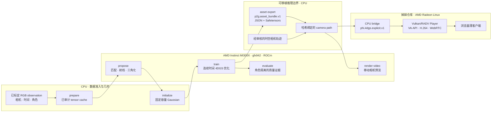

# Pixel4DGS

[English](README.md)

[](https://github.com/phi-media-lab/4dgs-reconstruction-Phi/actions/workflows/cpu-ci.yml)
[](https://github.com/phi-media-lab/4dgs-reconstruction-Phi/actions/workflows/release-check.yml)

Pixel4DGS 是一个架构优先、可训练的 pixel-to-4D-Gaussian 重建系统，由
Phi Media Lab 与 AMD 合作开发。它把同步、标定的多相机 RGB 视频转换为显式的
连续时间 Gaussian 场景；该场景可以被检查、评估、导出，并从移动相机视角渲染。

本仓库是 AMD 双仓库系统中的资产生产端。AMD Instinct MI300X 与 ROCm 负责
匹配、优化、评估和离线渲染；姊妹项目
[4DGS Viewer Phi](https://github.com/phi-media-lab/4dgs-viewer-Phi)
把推理资产转换后，交给 AMD Radeon Linux 节点通过 Vulkan、硬件 H.264 和
WebRTC 提供交互式服务。两个仓库只共享版本化、哈希闭合的资产，不共享源码树、
Python 环境或训练工作区。

## 系统架构



各个命令行 stage 与顶层 runner 调用相同的库函数。`p2g run` 只负责按顺序
执行已经定义的 stage、验证输出和 resume receipt，不隐藏第二条重建路径。训练
终止于可移植推理资产；交互式交付只在资产进入 Viewer 仓库后开始。

## AMD 软硬件协同设计

系统为计算与交付分配了不同的 AMD 硬件职责，而不是把两类 workload 强行压入
一个最低公共能力的运行时。

| 系统关注点 | 参考设计 | 设计结果 |
| --- | --- | --- |
| 重建计算 | 单张 AMD Instinct MI300X，`gfx942` | 显式准入 GPU ABI；v0 不宣称通用 CUDA、多 GPU 或任意 ROCm 支持 |
| 训练运行时 | Linux x86-64、CPython 3.12、PyTorch `2.10.0+rocm7.0`、HIP `7.0.51831` | Native 执行前检查源码、wheel 身份、HIP runtime 与 `gfx942` code object |
| 可微光栅化 | 固定版本的 AMD Ecosystem gsplat 源码、float32、packed mode、`tile_size=8`、单相机、classic EWA、RGB 或 SH3 | Adapter 固定所有 renderer switch，并拒绝未经验证的 shape、dtype、device 与 ABI |
| 训练热路径 | Struct-of-arrays tensor、向量化时间求值、mmap observation、单次 packed raster call | Gaussian 求值不使用 Python 循环；materialization/raster 热路径不把图像或 Gaussian 搬回 host |
| 种群与内存 | 固定容量 relocation 与稳定 slot lineage | 在不让 Gaussian 数量无限增长、也不隐藏 allocator 行为的条件下重新分配表示能力 |
| 资源准入 | AMD SMI/ROCm SMI observation、`/dev/kfd` 进程身份与全 stage resource-window 记录 | Shared quality run 与 exclusive performance run 使用不同且可重放的准入语义 |
| 交互式交付 | AMD Radeon、Linux `amdgpu`/DRM、Mesa RADV、Vulkan、DMA-BUF、VA-API、GStreamer、WebRTC | Viewer 的渲染和编码不依赖 ROCm、PyTorch、dataset 或 optimizer |

这种平台特化是有意为之。只有在相机几何、tensor layout、native ABI、梯度、
资产哈希和 observation role 等显式边界都成立后，结果才会被视为 MI300X
证据。可移植 CPU 测试验证合同与失败行为，不被当成 native kernel 质量或
场景级性能的证明。

精确的软件栈与执行门见
[MI300X 运行时构建](docs/MI300X_RUNTIME_BUILD.md)、
[渲染器合同](docs/RENDERER_CONTRACT.md)和
[MI300X preflight](docs/MI300X_PREFLIGHT_CONTRACT.md)。

## 重建管线

| 阶段 | 机制 | 输出 | 执行位置 |
| --- | --- | --- | --- |
| `prepare` | 验证相机、时间、光度、哈希、路径和角色隔离；生成 append-only RGB tensor cache | `p2g.tensor_cache.v1` | CPU |
| `propose` | 只匹配 train 视角，还原准入像素坐标，构造射线并三角化，同时保留拒绝证据 | Proposal collection | MI300X |
| `initialize` | 选择多视角证据并推导位置、运动、尺度、持续时间、外观和稳定 slot identity | `p2g.gaussian_initialization.v1` | CPU |
| `train` | 在采样时间 materialize Gaussian，执行 raster、已声明 loss 的优化，以及固定预算 relocation | 哈希闭合的 run 与 checkpoint | MI300X |
| `evaluate` | 渲染 diagnostic 或被显式准入的 sealed observation，结果不反馈给优化 | Evaluation receipt | MI300X |
| `asset export` | 去除 optimizer state，只发布可移植推理 tensor 与 provenance | `p2g.asset_bundle.v1` | CPU |
| `render-video` | 沿单独绑定的时空相机轨迹对 bundle 求值 | 视频与 render receipt | MI300X |

输入权威是 observation manifest，而不是数据集专用 loader。Charge adapter
在不复制源像素的条件下导入已标定静态图像任务。SelfCap adapter 把同步视频
物化为 RGB8 PNG 和逐帧、逐相机的 observation manifest，同时记录同步、
去畸变、裁剪、缩放、量化与源文件哈希。两个 adapter 都保持 train、
diagnostic 与 sealed observation 相互隔离。

## 白盒 4DGS 模型

每个 Gaussian 存储参考位置、速度、log scale、quaternion、opacity logit、
spherical-harmonic appearance、中心时间、有界持续时间、可选的 learned
persistence，以及稳定运行时身份。在查询时间 $t$：

$$
\boldsymbol{\mu}_i(t)=\boldsymbol{\mu}_i+\boldsymbol{v}_i(t-c_i)
$$

$$
g_i(t)=\exp\left[-\frac{1}{2}\left(\frac{t-c_i}{\sigma_i}\right)^2\right],\qquad a_i(t)=p_i+(1-p_i)g_i(t)
$$

$$
\alpha_i(t)=\frac{a_i(t)}{1+\exp(-o_i)}
$$

因此，时间通过具名状态改变位置与激活值，而不是隐藏在颜色、尺度或按帧索引的
神经解码器中。持续时间有界，quaternion 会归一化，log scale 在 materialize
时指数化。开发者可以检查任意连续时间上送入光栅器的准确 Gaussian 状态。

单个优化 step 的顺序固定：采样 train observation、materialize、rasterize、
计算具名 loss、反向传播、拒绝非法梯度、更新参数，最后执行预定的种群控制和
screen-influence 事件。L1、Gaussian-window SSIM、LPIPS、PSNR 和每个
regularizer 在 metric 与 receipt 中都保持独立归因。

## 正确性不变量

- **角色隔离。** 只有 `train` observation 可以影响 proposal、初始化、优化、
  screen guard、early stopping 或 checkpoint 选择。`diagnostic`、`sealed`
  与 `free_view` 是不同 capability。
- **Native 执行 fail closed。** 未注册的 Torch/ROCm/provider ABI、GPU 架构、
  tensor layout 或 raster option 会在 kernel launch 前被拒绝。
- **固定种群。** Relocation 复用 dead slot、保留稳定 lineage，并显式失效对应
  optimizer row。
- **哈希闭合状态。** 每个 stage 的输入输出都以 SHA-256 绑定依赖；terminal
  manifest 最后发布，因此部分写入的输出不会被静默 resume。
- **狭窄信任边界。** Checkpoint 是本地可信的 resume 状态；交换资产只包含
  JSON 与 Safetensors，不包含可执行 pickle、源图像、optimizer state 或隐含
  训练环境。
- **证据相互独立。** 源码 CI、native 数值验证、完整场景重建质量、Viewer
  转换与浏览器交付是不同声明，分别由不同 receipt 支持。

## 资产边界与 Viewer

Pixel4DGS 导出 `p2g.asset_bundle.v1`。相机轨迹是独立 artifact，只有与
bundle 进行哈希绑定后才能渲染。对于已支持的互操作 profile，Viewer 的 CPU
bridge 会验证 bundle，要求 learned persistence、SH degree 3、采用
`radius_clip = 0` 的 classic rasterization，并确定性地转换为
`phi.4dgs.explicit.v1`。

交接链路已经使用一个包含 499,980 个 SH3 Gaussian 的真实场景资产跑通：
离线转换、AMD Vulkan 渲染、VA-API H.264 编码、WebRTC 显示，以及浏览器中的
相机/时间交互均已完成。获得授权的预览由
[Viewer 仓库](https://github.com/phi-media-lab/4dgs-viewer-Phi)发布。
这证明该资产的格式与服务交接已经成立；它不代表任意 bundle 都兼容，也不代表
当前公开源码已经复现该训练任务，更不代表 cross-renderer pixel parity 或
长时间服务稳定性已经通过。

具体边界见 [Viewer 互操作](docs/VIEWER_INTEROP.md)和仓库中的
[Viewer profile](examples/viewer-interop/profile.toml)。

## 当前验证边界

| 本仓库已经建立 | 被有意分离或尚未声明 |
| --- | --- |
| 完整 CPU 合同测试、lint、类型检查、clean committed 源码边界检查，以及可复现 wheel/sdist 检查 | 把 CPU CI 当成 MI300X 吞吐或视觉质量证据 |
| 完整的 prepare → propose → initialize → train → evaluate → export 实现、stage receipt 与精确 resume 语义 | 支持未标定/单目输入、其他 GPU ABI 或多 GPU 训练 |
| 不可变的 MI300X native 源码构建 recipe，以及准入 raster profile 的 forward/gradient 验证 | 在仓库内附带真实场景数据集、外部 matcher/LPIPS 权重、训练资产或 benchmark |
| 离线 AssetBundle 检查、验证、camera-path 绑定与移动相机渲染 | 自动获得输入媒体或派生资产的再分发权 |
| 通往姊妹 AMD Radeon Viewer 的窄接口已经过测试 | 通用格式转换、cross-renderer parity、生产级网络或多用户服务 |

当前支持的重建边界是：同步、标定、离线去畸变的 pinhole RGB；单张可见
MI300X；float32；每个 raster batch 一台相机；显式线性运动与时间激活。
收窄范围是为了可复现，并不表示更广泛的输入或硬件在原理上不可能。

## 运行与理解系统

一个真实、已准入的场景由一份经过审核的 TOML plan 驱动：

```bash
p2g run pipeline.toml --workspace runs/scene-a
p2g status runs/scene-a
```

命令发现、CPU-only fixture、数据导入、native runtime 构建、stage 恢复和
资产渲染分别放在专项文档中，不在这份架构总览里重复。

| 问题 | 文档 |
| --- | --- |
| 数据、优化、资产和 Viewer 如何组成完整系统？ | [架构](docs/ARCHITECTURE.md) |
| 如何运行最小公开工作流？ | [快速开始](docs/QUICKSTART.md) |
| 哪些输入会被系统准入？ | [数据合同](docs/DATA_CONTRACT.md) |
| 4DGS 状态如何表示与训练？ | [模型](docs/MODEL_CONTRACT.md) · [训练](docs/TRAINING_CONTRACT.md) · [relocation](docs/RELOCATION_CONTRACT.md) |
| MI300X 的准确运行时是什么？ | [运行时构建](docs/MI300X_RUNTIME_BUILD.md) · [渲染器](docs/RENDERER_CONTRACT.md) · [preflight](docs/MI300X_PREFLIGHT_CONTRACT.md) |
| Stage 如何恢复与审计？ | [管线编排](docs/PIPELINE_ORCHESTRATION.md) · [可复现性](docs/REPRODUCIBILITY.md) |
| 如何验证、渲染资产或交给 Viewer？ | [资产消费](docs/ASSET_CONSUMPTION.md) · [Viewer 互操作](docs/VIEWER_INTEROP.md) |
| 全部详细合同在哪里？ | [文档索引](docs/README.md) |

## 开源边界

仓库自有源码、文档与生成式 synthetic fixture 采用 Apache-2.0；见
[LICENSE](LICENSE)和[NOTICE](NOTICE)。外部 native library、模型权重、
数据集、训练资产与渲染媒体保留各自条款，并不随本仓库分发。FreeTimeGS++ 与
3DGS-MCMC 是研究参考，不是运行时依赖；Pixel4DGS 独立实现并测试自己的
种群控制合同。

发布派生资产或提出质量/性能声明前，请阅读
[第三方声明](THIRD_PARTY_NOTICES.md)、
[许可证与来源](docs/LICENSE_AND_PROVENANCE.md)和
[发布流程](docs/RELEASE_PROCESS.md)。
